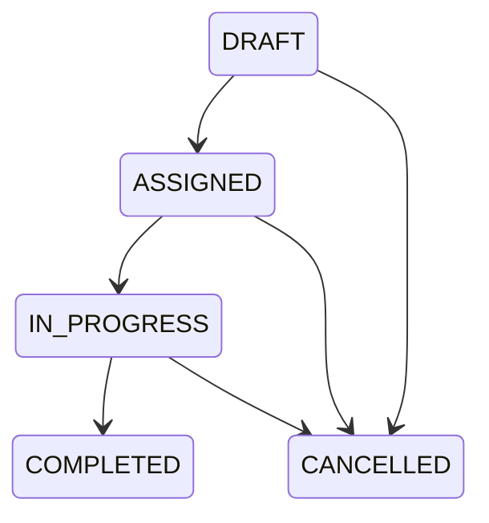

# Business rules

The operational rules below remain planned; persistence and authentication safeguards are implemented through Phase 3.

Trip transitions:

COMPLETED and CANCELLED are terminal. Cancellation requires a nonblank reason. Assignment requires an available driver and vehicle and reserves both atomically. The database also prevents overlapping active reservations. On completion or cancellation restore reserved resources atomically. Completion updates the vehicle odometer and final trip fields.

Start odometer must be at least current vehicle odometer. End odometer must be at least start odometer. Actual return must not precede start. Only the assigned driver may start/add notes to their trip; coordinator completion must satisfy the same validations. Draft orders alone may be edited.

A service is overdue if the due date has passed OR the current vehicle odometer has reached its threshold, while the schedule is incomplete. Upcoming-service horizon is configurable. Logging maintenance records and completing the relevant schedule occur in one transaction. Next service thresholds create a new schedule. Mechanic review records reviewer and UTC time on each attention note.

No real personal or operational data will be seeded. Development seeding must be explicitly enabled; account passwords come from configuration and demo login instructions will be documented when seeding exists.
